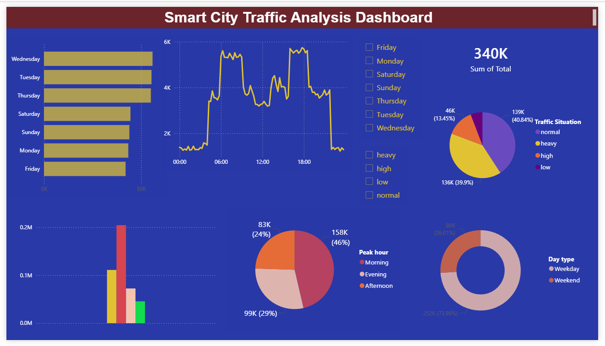

# Smart City Traffic Analysis Dashboard

## Project Overview
This project analyzes urban traffic patterns using Excel, SQL, and Power BI. 
The dashboard helps identify traffic congestion trends, peak traffic hours, and weekday/weekend traffic distribution.

## Tools Used
- Excel
- SQL
- Power BI

## Key Features
- Traffic volume analysis
- Peak hour identification
- Weekday vs Weekend comparison
- Traffic situation classification
- Interactive dashboard visualization

## Files Included
- Dataset (CSV files)
- SQL Queries
- Power BI Dashboard (.pbix)
- Dashboard Screenshots

## Skills Demonstrated
- Data Cleaning
- Data Analysis
- SQL Querying
- Data Visualization
- Dashboard Development
- Business Insights

## Dashboard Preview

